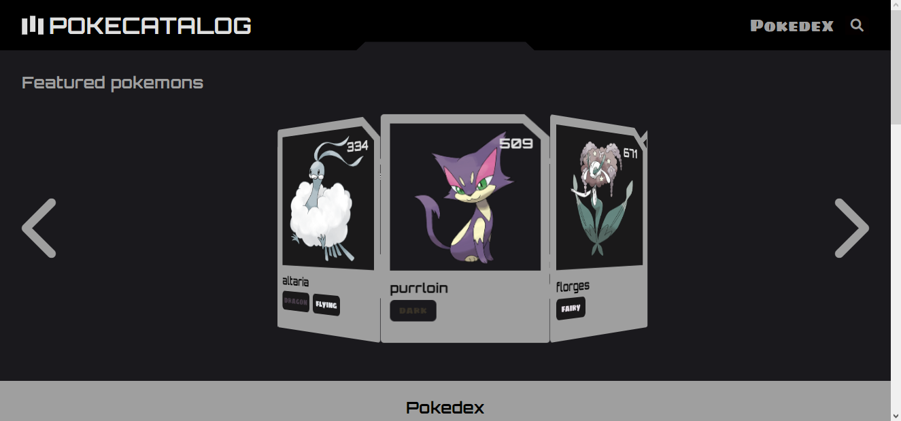
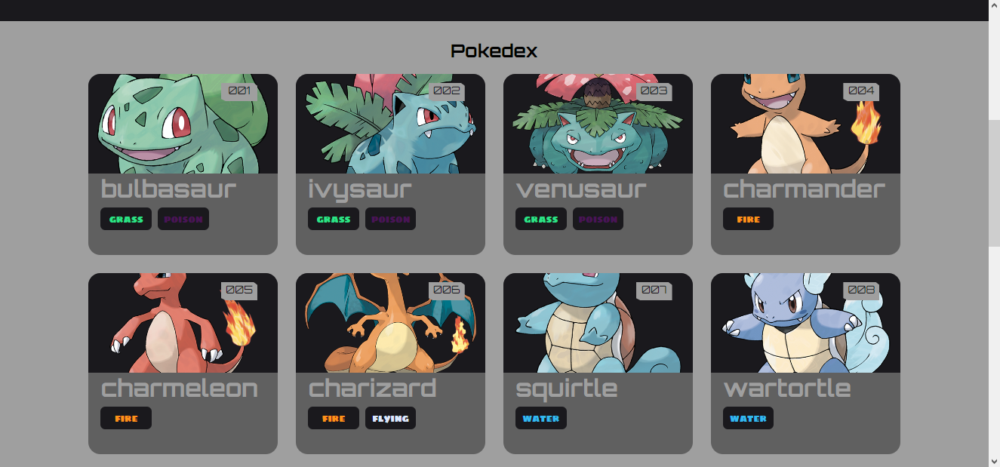
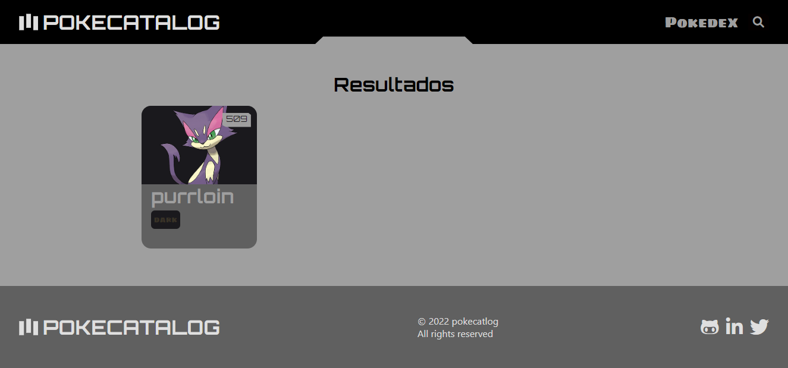

# **POKECatalog**





## **Sobre**
Um aplicação que cataloga pokemons consultando a [PokéApi](https://pokeapi.co/?ref=public-apis).
 
## **Tecnologias**
Esse projeto foi desenvolvido com as seguintes tecnologias:

- [JS]("https://developer.mozilla.org/en-US/docs/Web/javascript")

- [EJS]("https://ejs.co")

- [SaaS]("https://sass-lang.com/documentation/syntax")

- [Express]("http://expressjs.com") 

- [Axios]("https://axios-http.com")

## Como Iniciar o projeto
```bash
    npm start
```
